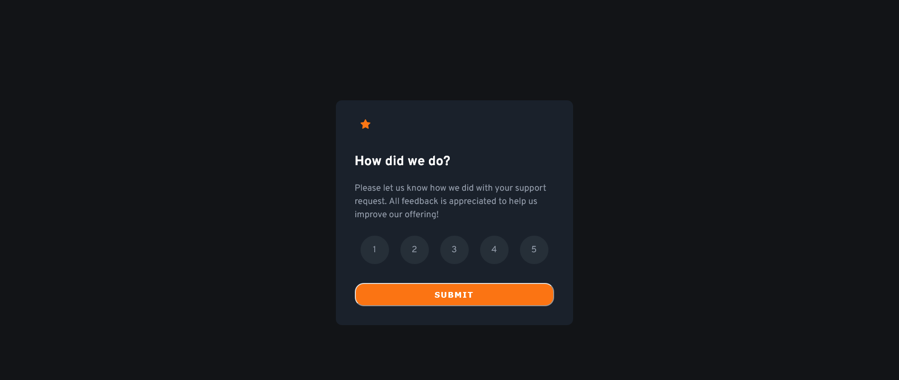
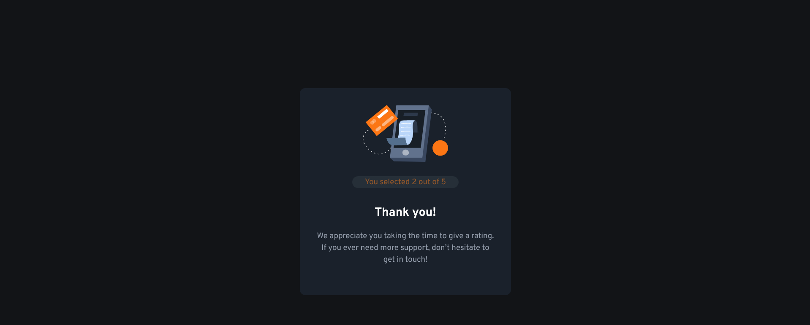
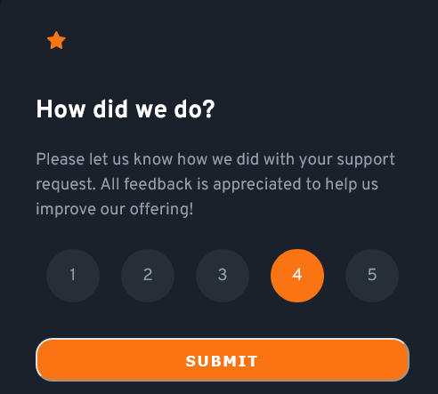

# Frontend Mentor - Interactive rating component solution

This is a solution to the [Interactive rating component challenge on Frontend Mentor](https://www.frontendmentor.io/challenges/interactive-rating-component-koxpeBUmI). Frontend Mentor challenges help you improve your coding skills by building realistic projects.

## Table of contents

-   [Overview](#overview)
    -   [The challenge](#the-challenge)
    -   [Screenshot](#screenshot)
    -   [Links](#links)
-   [My process](#my-process)
    -   [Built with](#built-with)
    -   [What I learned](#what-i-learned)
    -   [Continued development](#continued-development)
    -   [Useful resources](#useful-resources)
-   [Author](#author)
-   [Acknowledgments](#acknowledgments)

## Overview
I Use this challenge to practice my javascript skill. The project asked to let user choose rating over a product or service and then return a thank you page with the rating value selected by user. This is good project to practice HTML DOM, event listener, and how to work on reference object in event listener.

### The challenge

Users should be able to:

-   View the optimal layout for the app depending on their device's screen size
-   See hover states for all interactive elements on the page
-   Select and submit a number rating
-   See the "Thank you" card state after submitting a rating

### Screenshot





### Links

-   Solution URL: [Github](https://github.com/Odiesta/interactive-rating-component-main)
-   Live Site URL: [Github Pages](https://odiesta.github.io/interactive-rating-component-main/)

## My process

I Started design the rating section first, and make it looks closely like the design. Then make the style have behavior with JS. The challenge that i struggle a lot was to style the rating when user clicked it, then when the user click the other rating, that rating was styled as selected and the previous rating was styled back to normal. Then design the thankyou section.

### Built with

-   HTML5
-   CSS
-   Flexbox
-   Javascript
-   JS DOM

### What I learned

- To get the element in html with javascript i use `document.querySelector` and `document.querySelectorAll` to select more than one element.

- To access element in `querySelectorAll` i need to use `[]` and specify the element position

- I learned how to make reference to previous object by saving it to variable. accessing the current object using `this` keyword

```js
var ratingSelectedBefore = document.querySelector(".rate");

document.querySelectorAll(".rate")[i].addEventListener("click", function() {
    ratingSelectedBefore = this;
});
```

- To add class to element using javascript use `element.classList.add("class-name")`

- To remove class on element using javascript use `element.classList.remove("class-name")`

- I learn to center list item inside circle using display flex in li tag

```html
<ul>
  <li class="default-li rate">1</li>
  <li class="default-li rate">2</li>
  <li class="default-li rate">3</li>
  <li class="default-li rate">4</li>
  <li class="default-li rate">5</li>
</ul>
```

```css
.rating ul li {
  height: 3rem;
  width: 3rem;
  border-radius: 50%;
  display: flex;
  align-items: center;
  justify-content: center;
}
```

### Continued development

I plan to practice more Javascript and learn JQuery.

### Useful resources

-   [The Complete 2022 Web Development Bootcamp](https://www.udemy.com/course/the-complete-web-development-bootcamp/) - This course helped me understand how to use DOM in HTML. DOM exist in part 11 of the course. On part 13 i learn how to use event listener in javascript.

## Author

- Website - [Odiesta Shandikarona](https://github.com/Odiesta)
- Frontend Mentor - [@Odiesta](https://www.frontendmentor.io/profile/Odiesta)
- Twitter - [@OdiestaS](https://twitter.com/OdiestaS)

## Acknowledgments

I give my thanks to [frontendmentor](https://www.frontendmentor.io) for creating this challenge where i able to practice my javascript skill by building real world project.
